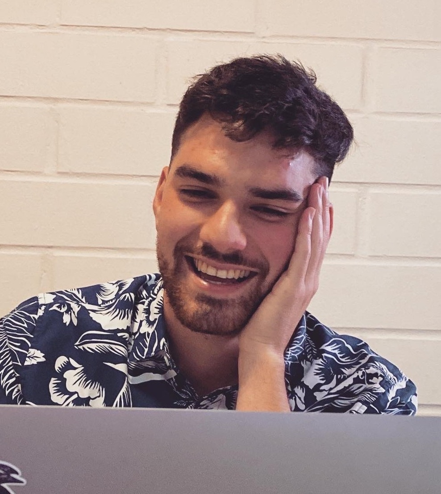

# **El equipo**

### Simone Baldanzi

{width="5.4cm"}

Profesor de la Facultad de Ciencias del Mar y RR NN. de la Universidad
de Valparaiso y director del laboratorio de Ecoficioslogia y Ecologia
evolutiva marina (e°CO~2~lab) "El núcleo central de mis preguntas
científicas nacen de la necesidad de entender como el cambio climático y
el impacto antrópico en curso afectan a los organismos marinos en todos
los niveles de organización biológica, desde sus componentes moleculares
hasta el ecosistema, pasando por respuestas fisiológicas a nivel de los
organismos".

------------------------------------------------------------------------

### Francisca Fernandez

Bióloga Marina de la Universidad de Valparaíso Asistente de fondecyt
11221161

------------------------------------------------------------------------

### Lucas Bravo Guzman

{width="5.4cm"}

Biólogo Marino de la Universidad de Valparaíso y actual asistente de
investigación en el laboratorio e°CO~2~lab. "Mi pasión por la ciencia
fue influida por lecturas como journey of the universe y la trama de la
vida, los cuales abarcan una filosofía de las ciencias que me hizo
comprender como vivimos en un ecosistema interconectado. Desde esta
premisa, quise hacer lo que estuviese a mi alcance para comprender como
hemos acelerado el cambio climatico y como este influye sobre
invertebrados marinos, mi interes ahora esta orientado en estudios
transgeneracionales evaluando aspectos fisiologicos y geneticos."

fa("water")

